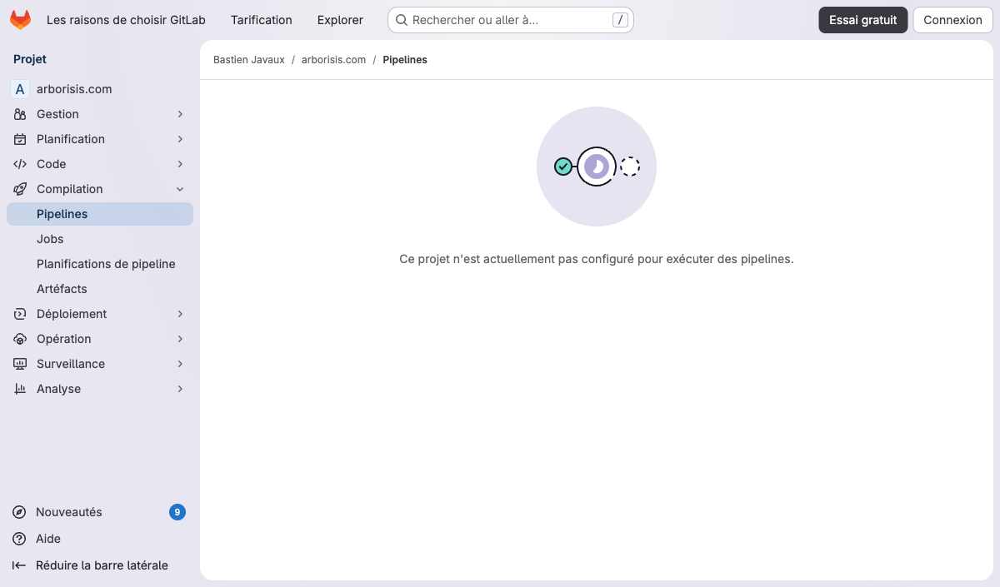
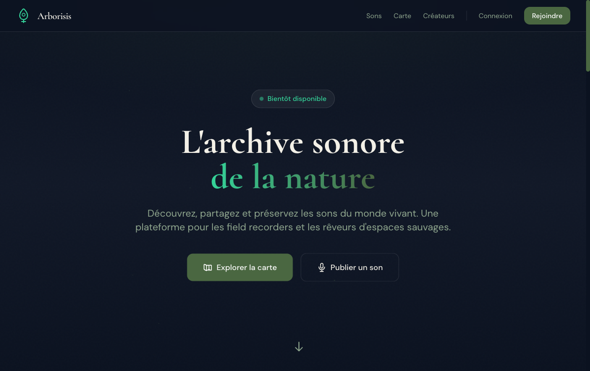

<div align="center">

# 🌿 Arborisis

**La plateforme sociale premium dédiée aux sons de la nature.**

*Capturez, partagez et explorez le monde sonore sauvage.*

[](https://gitlab.com/bastienjavaux/<redacted>.com/-/commits/main)
[](https://gitlab.com/bastienjavaux/<redacted>.com/-/commits/main)
[](https://php.net)
[](https://laravel.com)
[](https://vuejs.org)
[](https://tailwindcss.com)
[](LICENSE)

[🌐 Site web](https://<redacted>.com) · [📖 Documentation](#documentation) · [🚀 Installation](#installation-rapide) · [🤝 Contribuer](#contribuer)

</div>

---

## 📸 Aperçu

<div align="center">

| Pipeline CI/CD | Déploiement Production |
|:---:|:---:|
|  |  |

</div>

---

## ✨ Qu'est-ce qu'Arborisis ?

Arborisis est une **plateforme sociale immersive** pensée pour les *field recorders*, naturalistes et amateurs de sons sauvages. Elle permet de :

- 🎙️ **Uploader** des enregistrements naturels avec métadonnées riches (équipement, environnement, conditions)
- 🗺️ **Explorer** une carte interactive mondiale des sons (Leaflet + clustering)
- 💚 **Soutenir** les créateurs via le système de crédits internes **ECHO**
- 🔒 **Protéger** la biodiversité — les coordonnées GPS exactes ne sont jamais exposées publiquement
- 🎧 **Écouter** via un lecteur premium avec waveform (Wavesurfer.js)

> **ECHO** est un système de crédits internes — ni cryptomonnaie, ni investissement. Une façon simple de valoriser le travail des créateurs.

---

## 🛠 Stack Technique

### Backend
| Technologie | Version | Rôle |
|-------------|---------|------|
| **Laravel** | 12.x | Framework PHP — API, auth, queues |
| **PHP** | 8.3+ | Typage strict, enums, performance |
| **PostgreSQL** | 16+ | Base de données + PostGIS (géospatial) |
| **Redis** | 7+ | Cache, sessions, queues, rate limiting |
| **Laravel Cashier** | 15.x | Intégration Stripe (packs ECHO) |
| **Filament** | 3.x | Panel d'administration |
| **Contabo S3** | — | Stockage audio et images |

### Frontend
| Technologie | Version | Rôle |
|-------------|---------|------|
| **Vue 3** | 3.4+ | SPA réactive (Composition API) |
| **Inertia.js** | 2.x | Bridge Laravel ↔ Vue sans API REST |
| **Tailwind CSS** | 4.x | Design system utility-first |
| **shadcn-vue** | Dernier | Composants UI accessibles |
| **Leaflet** | 1.9+ | Carte interactive mondiale |
| **Wavesurfer.js** | 7.x | Waveform audio premium |
| **Pinia** | — | État global (mini-player persistant) |

---

## 🏗 Architecture

```
┌─────────────────────────────────────────────────────────────┐
│                        CLIENT                               │
│  ┌──────────────┐  ┌──────────────┐  ┌──────────────────┐  │
│  │  Vue 3 SPA   │  │   Leaflet    │  │ Wavesurfer.js    │  │
│  │  (Inertia)   │  │    Map       │  │ Player           │  │
│  └──────┬───────┘  └──────┬───────┘  └────────┬─────────┘  │
│         └─────────────────┴─────────────────────┘            │
│                           │                                 │
│                    Inertia Requests (XHR)                   │
└───────────────────────────┬─────────────────────────────────┘
                            │
┌───────────────────────────┼─────────────────────────────────┐
│                    LARAVEL BACKEND                          │
│  ┌────────────────────────┼─────────────────────────────┐   │
│  │  HTTP Layer            │  Routes → Middleware → ...  │   │
│  │  Service Layer         │  SoundService, EchoService   │   │
│  │  Models                │  Eloquent + Relations        │   │
│  └────────────┬───────────┴───────────┬─────────────────┘   │
│               │                       │                     │
│  ┌────────────┴──┐  ┌────────────────┴──┐  ┌────────────┐  │
│  │  PostgreSQL   │  │      Redis        │  │ Contabo S3 │  │
│  │  (Data+PostGIS)│  │ (Cache/Queue)     │  │(Audio/Img) │  │
│  └───────────────┘  └───────────────────┘  └────────────┘  │
└─────────────────────────────────────────────────────────────┘
```

### Principes clés
- **Single Responsibility** — Un service = un domaine métier
- **Privacy-first** — Coordonnées exactes jamais en API publique
- **Fail-safe** — Uploads transactionnels (DB + S3)
- **Audit trail** — Journal ECHO immuable
- **Defense in depth** — Validation à tous les niveaux

---

## 🚀 Installation Rapide

### Prérequis
- PHP 8.3+
- PostgreSQL 16+ (avec PostGIS)
- Redis 7+
- Node.js 20+
- Composer 2+

### 1. Cloner le projet
```bash
git clone https://gitlab.com/bastienjavaux/<redacted>.com.git
cd <redacted>.com/<redacted>
```

### 2. Installer les dépendances
```bash
composer install
npm install
```

### 3. Configurer l'environnement
```bash
cp .env.example .env
php artisan key:generate
```

Éditer `.env` avec vos credentials :
```env
DB_CONNECTION=pgsql
DB_HOST=127.0.0.1
DB_PORT=5432
DB_DATABASE=<redacted>
DB_USERNAME=<redacted>
DB_PASSWORD=secret

CACHE_DRIVER=redis
SESSION_DRIVER=redis
QUEUE_CONNECTION=redis
REDIS_HOST=127.0.0.1

AWS_ACCESS_KEY_ID=xxx
AWS_SECRET_ACCESS_KEY=xxx
AWS_DEFAULT_REGION=eu2
AWS_BUCKET=<redacted>-audio
AWS_ENDPOINT=https://eu2.contabostorage.com
AWS_USE_PATH_STYLE_ENDPOINT=true
```

### 4. Base de données & assets
```bash
php artisan migrate --seed
npm run build
```

### 5. Lancer
```bash
php artisan serve
npm run dev   # dans un autre terminal
```

---

## 📂 Structure du Projet

```
<redacted>/
├── app/
│   ├── Http/Controllers/      # Web + API controllers
│   ├── Http/Requests/         # Form Requests (validation)
│   ├── Models/                # Eloquent + relations
│   ├── Services/              # Logique métier
│   ├── Policies/              # Autorisations
│   └── Jobs/                  # Queues (audio, waveform)
├── resources/js/
│   ├── Pages/                 # Pages Inertia (Vue)
│   ├── Components/            # Composants réutilisables
│   ├── Composables/           # Logique Vue réutilisable
│   └── Stores/                # Pinia (player global)
├── database/migrations/       # Schéma PostgreSQL
├── routes/                    # web.php, api.php, admin.php
└── tests/                     # Feature + Unit tests
```

> Pour plus de détails, voir [`ARCHITECTURE.md`](ARCHITECTURE.md).

---

## 🔧 Développement

### Commandes utiles
```bash
# Mode développement
npm run dev

# Build production
npm run build

# Tests
php artisan test

# Queue worker
php artisan queue:work

# Linter
./vendor/bin/pint
```

### Conventions de code
- PHP 8.3+ avec `declare(strict_types=1)`
- Enums PHP pour tous les statuts et rôles
- Form Requests pour toute validation entrante
- Policies Laravel pour les autorisations
- Services pour la logique métier (pas dans les controllers)
- Vue 3 Composition API + TypeScript recommandé
- Tailwind CSS avec palette personnalisée Arborisis

> Voir [`AGENTS.md`](AGENTS.md) pour les conventions complètes.

---

## 🚀 Déploiement

Le pipeline GitLab CI contient un job manuel `deploy_production` pour déployer
Arborisis sur un VPS via SSH + rsync, avec releases atomiques et dossiers
partagés.

Voir [`docs/deploiement-gitlab-vps.md`](docs/deploiement-gitlab-vps.md).

---

## 🧪 Tests

```bash
# Tests complets
php artisan test

# Avec coverage
php artisan test --coverage

# Tests spécifiques
php artisan test --filter=SoundUploadTest
```

---

## 📋 Roadmap MVP

- [x] Socle Laravel + Inertia/Vue + design system
- [x] Upload audio + stockage S3 + métadonnées
- [x] Carte interactive (Leaflet) + clustering
- [x] Système social (likes, favoris, commentaires, follows)
- [ ] Système ECHO + Stripe Checkout
- [ ] Panel admin (Filament)
- [ ] Lecteur premium (Wavesurfer.js + mini-player)
- [ ] PWA + optimisations mobiles

---

## 🤝 Contribuer

Les contributions sont les bienvenues ! Merci de lire [`CONTRIBUTING.md`](CONTRIBUTING.md) avant de proposer une MR.

### Rapport de bug
Utilisez le template **Bug** dans les issues GitLab.

### Proposition de fonctionnalité
Utilisez le template **Feature** dans les issues GitLab.

---

## 📜 Licence

Ce projet est sous licence MIT. Voir le fichier [`LICENSE`](LICENSE) pour plus de détails.

---

<div align="center">

🌿 *Arborisis — Écoutez la nature.*

</div>
